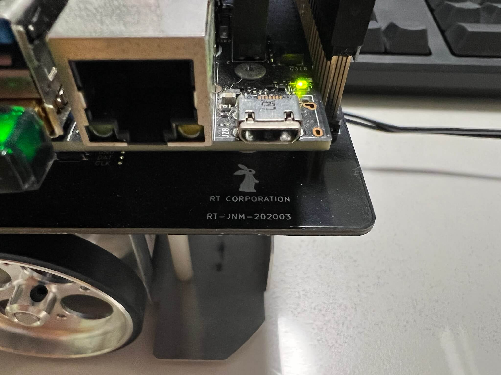
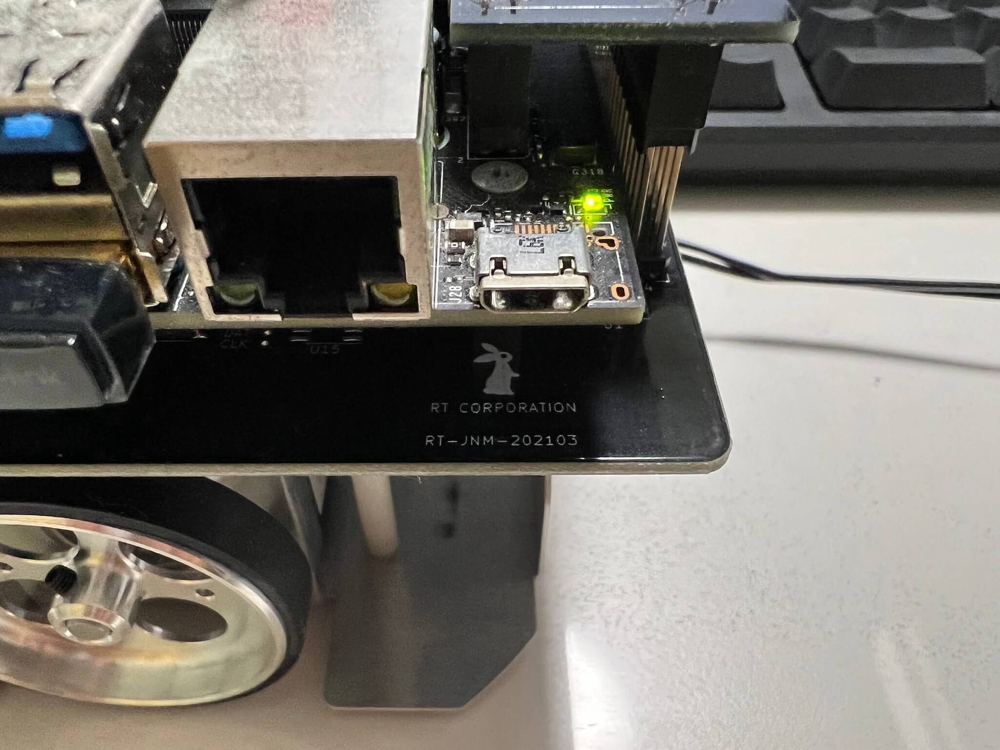

# Jetson Nano Mouse 回路図

Jetson Nano Mouseは2021年春ごろより出荷されているロットから基板にマイナーアップデートが入っています。

Jetson NanoのmicroUSB端子下の基板に書かれたシルクを確認することで基板のバージョンを確認できます。

* `RT-JNM-202003`と記載がある基板の回路図: [`JetsonNanoMouse-v1-20200324.pdf`](./JetsonNanoMouse-v1-20200324.pdf)
* `RT-JNM-202103`と記載がある基板の回路図: [`JetsonNanoMouse-v1-20210215.pdf`](./JetsonNanoMouse-v1-20210215.pdf)